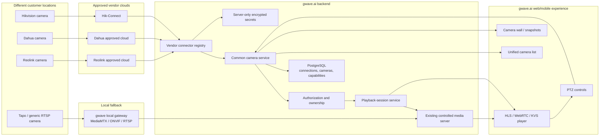
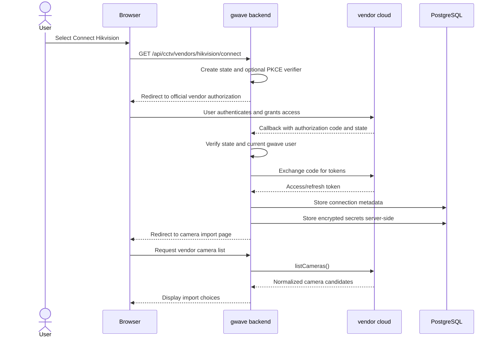
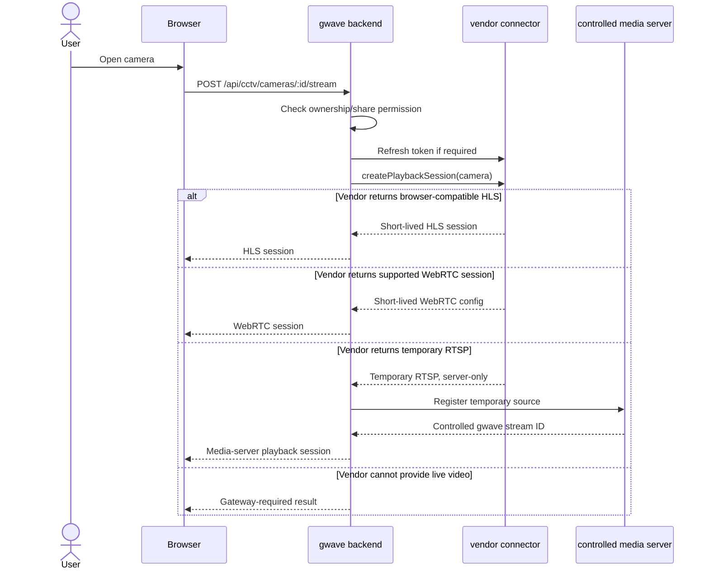

# gwave.ai — Vendor Cloud Camera Integration Tasks

**Suggested repository path:** `docs/tasks/VENDOR_CLOUD_CAMERA_INTEGRATION.md`  
**Status:** Proposed  
**Target:** Web MVP first  
**First real provider:** Hikvision, subject to approved partner credentials and official API access  
**Fallback:** Existing RTSP/ONVIF local-gateway path  
**Prepared:** 2026-08-03

---

## 0. Instructions for the Claude Code session

This repository is under active development. Do not begin implementation immediately.

Before editing:

- [ ] Read `CLAUDE.md`.
- [ ] Read the newest `docs/STATUS.md`.
- [ ] Fetch `origin/main`.
- [ ] Check open pull requests and active branches.
- [ ] Search the repository for any work already using:
  - `vendor_cloud`
  - `camera_vendor`
  - `hikvision`
  - `dahua`
  - `vendor connector`
  - `camera account linking`
- [ ] Do not start a parallel implementation if another Claude session is already working on this feature.
- [ ] Create a short-lived branch from the latest `main`.
- [ ] Keep web work separate from the active Flutter mobile branch.
- [ ] Update `docs/STATUS.md` after significant work is merged.
- [ ] Code, comments, migrations, commit messages, and PR descriptions must be in English.

Suggested branch:

```text
feature/cctv-vendor-cloud-framework
```

Required checks before merge:

```bash
pnpm lint
pnpm typecheck
pnpm build
pnpm e2e
git grep '^<<<<<<< '
```

Production remains AWS-only. Do not add a Vercel deployment path.

---

## 1. Current gwave.ai CCTV implementation

The current application already supports three camera source types:

```ts
type CameraType = "webrtc" | "rtsp" | "kvs";
```

### Current paths

```text
Phone / PC
    -> browser publishing
    -> configured media server
    -> gwave player

RTSP CCTV
    -> external media server / relay
    -> WebRTC or HLS
    -> gwave player

Amazon KVS
    -> local KVS Master
    -> KVS signaling + WebRTC
    -> gwave KVS player
```

Relevant existing files include:

```text
src/components/cctv/add-camera-form.tsx
src/components/cctv/camera-player.tsx
src/components/cctv/hls-player.tsx
src/components/cctv/kvs-player.tsx
src/components/cctv/camera-wall.tsx
src/components/cctv/ptz-controls.tsx
src/lib/actions/cctv.ts
src/lib/cctv.ts
src/lib/cctv-kvs.ts
src/lib/cctv-player.ts
src/types/database.ts
src/app/api/cctv/kvs/route.ts
supabase/migrations/*cctv*.sql
deploy/kvs-master/
```

The current RTSP form provides presets for:

- Tapo / TP-Link
- Hikvision
- Dahua
- Reolink
- Amcrest
- ONVIF / Generic

The Next.js server does not proxy the video itself. The external media server carries the actual stream. Existing environment variables include:

```text
CCTV_MEDIA_API_URL
CCTV_MEDIA_API_TOKEN
NEXT_PUBLIC_CCTV_PLAYER_ORIGIN
NEXT_PUBLIC_CCTV_APP
NEXT_PUBLIC_CCTV_HLS_ORIGINS
```

### Existing architecture pattern to reuse

The health integration already has a useful provider architecture:

```text
src/lib/health/types.ts
src/lib/health/registry.ts
src/lib/health/fitbit.ts
src/lib/db/health.ts
src/app/api/health/.../callback
```

Reuse the pattern of:

- Provider interface
- Provider registry
- Optional providers controlled by environment configuration
- OAuth callback with CSRF state validation
- Public metadata reads
- Server-only token access
- Normalized provider output

Do not copy any security weakness blindly. Camera tokens must receive stronger secret-storage treatment.

---

## 2. Product goal

Allow a user to link an approved camera-vendor account and import cameras into gwave.ai without installing a local gateway.

### Desired flow

```text
Wi-Fi camera
    -> vendor cloud
    -> official API / SDK
    -> gwave vendor connector
    -> common gwave camera service
    -> short-lived playback session
    -> gwave web player
```

### Fallback flow

When official cloud live-stream access is unavailable:

```text
RTSP / ONVIF camera
    -> local gwave gateway or VPN
    -> existing media server
    -> WebRTC / HLS
    -> gwave player
```

### Accurate product promise

Use this wording:

> gwave.ai supports approved vendor-cloud camera integrations and compatible RTSP/ONVIF cameras through a local gateway.

Do not promise support for every camera ever manufactured.

---

## 3. Simplest user scenario

A user owns one Hikvision Wi-Fi camera.

1. The camera is already configured in the Hik-Connect app.
2. The user opens `Add camera` in gwave.ai.
3. The user selects `Connect vendor account`.
4. The user selects `Hikvision`.
5. gwave redirects the user to the official vendor authorization process.
6. The user approves access.
7. gwave retrieves the user's available cameras.
8. The user imports `Front Door`.
9. gwave stores a reference to the camera, not the vendor password.
10. When the user clicks `View live`, the backend requests a fresh playback session.
11. The browser receives only a short-lived, authorized playback configuration.
12. The existing HLS player, a WebRTC adapter, or the controlled media relay displays the stream.

```text
Hikvision camera
        |
        v
Hik-Connect cloud
        |
        | official API / SDK
        v
HikvisionConnector
        |
        v
CommonCameraService
        |
        v
PlaybackSession
        |
        v
HLS / WebRTC / controlled relay
        |
        v
gwave.ai player
```

---

## 4. System design



### Account-linking sequence



### Live-view sequence



---

## 5. Support decision logic

Implement one decision service used by both backend and UI.

```text
Does the vendor have an approved official integration?
    |
    +-- No
    |    |
    |    +-- Camera supports RTSP/ONVIF?
    |           |
    |           +-- Yes -> Recommend local gateway
    |           +-- No  -> Unsupported camera
    |
    +-- Yes
         |
         +-- Does the approved API expose live video?
                |
                +-- Yes -> Use vendor-cloud connector
                +-- No
                     |
                     +-- RTSP/ONVIF available -> Recommend gateway
                     +-- No -> Metadata/events only; live view unavailable
```

Normalized result:

```ts
type CameraIntegrationRecommendation =
  | {
      method: "vendor_cloud";
      provider: CameraVendorId;
      liveView: true;
    }
  | {
      method: "local_gateway";
      protocols: Array<"rtsp" | "onvif">;
      reason: string;
    }
  | {
      method: "unsupported";
      reason: string;
    };
```

---

## 6. Vendor implementation matrix

This matrix is an engineering plan, not a guarantee of commercial access.

| Vendor or type | Vendor-cloud MVP status | Required action | Gateway fallback |
|---|---|---|---|
| Hikvision / Hik-Connect | Best first candidate | Obtain approved partner credentials, official API/SDK documentation, sandbox/test account, redirect URI, and live-view rights | RTSP/ONVIF |
| Dahua | Research and approval required | Confirm the exact approved cloud product, authentication method, live-session API, regions, licensing, and redistribution terms | RTSP/ONVIF |
| Reolink | Research and approval required | Confirm an official cloud API with third-party live-video rights for target models and regions | RTSP/ONVIF for compatible models |
| Amcrest | Research and approval required | Confirm official account-linking and live-stream API rather than relying only on local CGI/RTSP | RTSP/ONVIF |
| Tapo / TP-Link | Do not assume public cloud live API | Treat official partner integration as a separate commercial investigation | RTSP/ONVIF for compatible powered models |
| Generic ONVIF | No common vendor cloud | Use ONVIF for discovery/profile/PTZ through the local gateway | Required |
| Generic RTSP | No common vendor cloud | Use RTSP through the local gateway or secure VPN | Required |
| Cloud-only unknown brand | Usually unavailable | Require official API/SDK and written permission; do not reverse engineer the mobile app | Only if the device also exposes RTSP/ONVIF |

### Phase-zero deliverable

Create:

```text
docs/cctv/VENDOR_FEASIBILITY.md
```

For every proposed provider record:

- Official developer-program URL
- Partner approval status
- Supported countries/regions
- Authentication mechanism
- Camera-discovery endpoint
- Live-view method
- Stream type returned
- Session expiry
- PTZ support
- Snapshot/event support
- Rate limits
- Pricing/licensing
- CORS/browser restrictions
- Recording/redistribution rights
- Public-sharing restrictions
- Test account/device availability
- Local-gateway fallback

Do not write a production connector until these items are verified.

---

## 7. Database design

### 7.1 Add the new camera type

Add:

```text
vendor_cloud
```

to the existing PostgreSQL `camera_type` enum and TypeScript `CameraType`.

Important: use separate migrations if PostgreSQL prevents the newly added enum value from being used in the same transaction.

Suggested migrations:

```text
supabase/migrations/<timestamp>_camera_vendor_cloud_enum.sql
supabase/migrations/<timestamp>_camera_vendor_connections.sql
```

### 7.2 Connection metadata table

Create a user-visible metadata table without secrets:

```sql
create table camera_vendor_connections (
  id uuid primary key default gen_random_uuid(),
  user_id uuid not null references profiles(id) on delete cascade,
  provider text not null,
  provider_account_id text,
  account_label text,
  status text not null default 'connected',
  scopes text[] not null default '{}',
  connected_at timestamptz not null default now(),
  token_expires_at timestamptz,
  last_success_at timestamptz,
  last_error_code text,
  last_error_at timestamptz,
  created_at timestamptz not null default now(),
  updated_at timestamptz not null default now(),
  unique (user_id, provider, provider_account_id)
);
```

Suggested statuses:

```text
connected
expired
revoked
error
disconnected
```

Enable RLS:

- Owner may select their own metadata.
- Owner may request disconnect through a route/server action.
- Browser clients may not write token state directly.
- Admin/service role performs sensitive lifecycle writes.

### 7.3 Separate secret table

Do not place reusable tokens in a table visible to the user's PostgREST role.

```sql
create table camera_vendor_secrets (
  connection_id uuid primary key
    references camera_vendor_connections(id) on delete cascade,
  access_token_ciphertext text not null,
  refresh_token_ciphertext text,
  token_nonce text not null,
  token_auth_tag text not null,
  key_version integer not null default 1,
  created_at timestamptz not null default now(),
  updated_at timestamptz not null default now()
);
```

Requirements:

- Enable RLS.
- Do not create an owner-read policy.
- Grant access only to the service role.
- Encrypt at application level with AES-256-GCM.
- Keep the encryption key in `/etc/gwave-web.env`.
- Never store vendor passwords.
- Never log access tokens, refresh tokens, authorization codes, cookies, or stream tokens.

Suggested environment variable:

```text
CAMERA_VENDOR_TOKEN_KEY_V1=
```

Document the expected key format and rotation procedure.

### 7.4 Extend `user_cameras`

Add nullable vendor fields:

```text
vendor_connection_id uuid
vendor_camera_id text
vendor_provider text
vendor_display_model text
vendor_capabilities jsonb
vendor_metadata jsonb
vendor_last_seen_at timestamptz
```

Requirements:

- `vendor_connection_id` references `camera_vendor_connections`.
- A `vendor_cloud` camera requires:
  - `vendor_connection_id`
  - `vendor_camera_id`
  - `vendor_provider`
- Do not store a long-lived stream URL.
- Sanitize `vendor_metadata`; no credentials or private tokens.
- Use `vendor_capabilities` for normalized feature flags:

```json
{
  "liveView": true,
  "snapshot": true,
  "ptz": false,
  "audio": true,
  "twoWayAudio": false,
  "events": true,
  "playback": false,
  "publicSharingAllowed": false
}
```

### 7.5 Database types

Update:

```text
src/types/database.ts
```

Add types for:

- `vendor_cloud`
- `CameraVendorConnection`
- `CameraVendorCapabilities`
- New `UserCamera` fields

Avoid PostgREST resource embeds on hot paths. Query flat records and assemble them in TypeScript.

---

## 8. Provider framework

Create:

```text
src/lib/cctv/vendors/
├── types.ts
├── registry.ts
├── crypto.ts
├── errors.ts
├── fake.ts
└── hikvision.ts
```

### 8.1 Provider identifiers

Use a TypeScript union or registry-derived type, not a PostgreSQL enum:

```ts
export type CameraVendorId =
  | "hikvision"
  | "dahua"
  | "reolink"
  | "amcrest"
  | "tapo"
  | "fake";
```

The database stores provider as text so new providers do not require an enum migration.

### 8.2 Normalized tokens

```ts
export interface CameraVendorTokens {
  accessToken: string;
  refreshToken?: string;
  expiresAt?: Date;
  scope?: string[];
  providerAccountId?: string;
}
```

### 8.3 Normalized camera

```ts
export interface VendorCameraCandidate {
  provider: CameraVendorId;
  vendorCameraId: string;
  name: string;
  model?: string;
  serialNumberMasked?: string;
  online: boolean | null;
  capabilities: CameraVendorCapabilities;
  safeMetadata?: Record<string, unknown>;
}
```

Do not return raw serial numbers unless needed. Mask identifiers in the UI and logs.

### 8.4 Playback session

```ts
export type VendorPlaybackSession =
  | {
      kind: "hls";
      url: string;
      expiresAt?: string;
    }
  | {
      kind: "webrtc";
      provider: CameraVendorId;
      config: Record<string, unknown>;
      expiresAt?: string;
    }
  | {
      kind: "media_server";
      streamId: string;
      expiresAt?: string;
    }
  | {
      kind: "unsupported";
      reason: string;
      gatewayRecommended: boolean;
    };
```

Never return a raw RTSP URL to the browser.

### 8.5 Connector interface

```ts
export interface CameraVendorConnector {
  readonly id: CameraVendorId;
  readonly label: string;

  isEnabled(): boolean;

  buildAuthorizationUrl(input: {
    state: string;
    redirectUri: string;
    codeChallenge?: string;
  }): Promise<string>;

  exchangeAuthorizationCode(input: {
    code: string;
    redirectUri: string;
    codeVerifier?: string;
  }): Promise<CameraVendorTokens>;

  refreshTokens(tokens: CameraVendorTokens): Promise<CameraVendorTokens>;

  revoke(tokens: CameraVendorTokens): Promise<void>;

  getAccount(tokens: CameraVendorTokens): Promise<{
    providerAccountId?: string;
    label?: string;
  }>;

  listCameras(tokens: CameraVendorTokens): Promise<VendorCameraCandidate[]>;

  createPlaybackSession(input: {
    tokens: CameraVendorTokens;
    vendorCameraId: string;
  }): Promise<VendorPlaybackSession>;

  getSnapshot?(input: {
    tokens: CameraVendorTokens;
    vendorCameraId: string;
  }): Promise<{ contentType: string; bytes: Uint8Array }>;

  sendPtzCommand?(input: {
    tokens: CameraVendorTokens;
    vendorCameraId: string;
    command: CameraPtzCommand;
  }): Promise<void>;
}
```

Use Zod to validate every external vendor response.

### 8.6 Registry

Model this after the existing health provider registry:

```ts
const ALL_CAMERA_VENDOR_CONNECTORS = [
  fakeConnector,
  hikvisionConnector,
];

export function getEnabledCameraVendorConnectors() { ... }

export function getCameraVendorConnector(id: string) { ... }
```

A provider must disappear from the production UI when required configuration is absent.

### 8.7 Fake connector

Implement the fake connector before the real provider.

It must:

- Be available only in tests or explicitly enabled non-production development.
- Return deterministic cameras.
- Simulate token expiration and refresh.
- Return a test HLS/media-server session.
- Simulate an unsupported-camera response.
- Support route and Playwright tests without real vendor credentials.

Environment:

```text
CCTV_VENDOR_FAKE_ENABLED=false
```

The application must reject this provider in production.

---

## 9. Environment configuration

Add server-only configuration accessors in:

```text
src/lib/env.ts
```

Add documented variables to:

```text
.env.example
```

Suggested variables:

```text
CAMERA_VENDOR_TOKEN_KEY_V1=

HIKVISION_CAMERA_ENABLED=false
HIKVISION_CLIENT_ID=
HIKVISION_CLIENT_SECRET=
HIKVISION_AUTH_BASE_URL=
HIKVISION_API_BASE_URL=
HIKVISION_REDIRECT_URI=

CCTV_VENDOR_FAKE_ENABLED=false
```

Use the exact authentication fields required by the approved vendor API; do not invent OAuth if the vendor uses a different official mechanism.

Remember:

- Server runtime variables live in `/etc/gwave-web.env`.
- `NEXT_PUBLIC_*` values are baked at build time.
- Vendor client secrets must never use `NEXT_PUBLIC_*`.
- A server-only env change normally requires `sudo gwave-redeploy`.
- Do not place secrets in repository files or logs.

---

## 10. Data-access layer

Create:

```text
src/lib/db/cctv-vendors.ts
```

Functions should include:

```ts
listVendorConnections(userId)
getVendorConnectionForOwner(userId, connectionId)
getVendorConnectionForService(connectionId)
saveVendorConnection(...)
saveEncryptedVendorSecrets(...)
getDecryptedVendorTokens(...)
updateVendorTokens(...)
markVendorConnectionError(...)
disconnectVendorConnection(...)
listImportedVendorCameras(...)
```

Rules:

- Request-scoped client for safe owner-visible metadata.
- Admin/service client for secret reads and writes.
- Select explicit columns.
- Throw on failed critical writes.
- Never return secret fields from UI-facing functions.
- Avoid resource embeds.
- Prevent concurrent refresh races:
  - optimistic version/timestamp update, or
  - a short database lock around refresh.
- If refresh fails with an authorization error, mark the connection `expired`.
- Transient vendor/network failures must not delete the connection.

---

## 11. API routes

Suggested routes:

```text
GET  /api/cctv/vendors
GET  /api/cctv/vendors/[provider]/connect
GET  /api/cctv/vendors/[provider]/callback
GET  /api/cctv/vendors/[provider]/cameras
POST /api/cctv/vendors/[provider]/import
POST /api/cctv/vendors/[provider]/disconnect

POST /api/cctv/cameras/[cameraId]/stream
POST /api/cctv/cameras/[cameraId]/ptz
GET  /api/cctv/cameras/[cameraId]/snapshot
```

### 11.1 Provider list

Return only enabled providers and safe capabilities:

```json
{
  "providers": [
    {
      "id": "hikvision",
      "label": "Hikvision",
      "accountLinking": true
    }
  ]
}
```

### 11.2 Connect

Requirements:

- Require the current gwave user.
- Generate a cryptographically random state.
- Use PKCE when supported.
- Store state and verifier in secure, HTTP-only, SameSite cookies.
- Bind the state to the current gwave user and provider.
- Set a short expiration.
- Redirect only to an allow-listed official vendor domain.

### 11.3 Callback

Requirements:

- Validate state.
- Validate provider.
- Validate current gwave user.
- Reject reused/expired state.
- Exchange the authorization code server-side.
- Store safe connection metadata.
- Encrypt and store secrets separately.
- Clear temporary cookies.
- Redirect to the vendor camera import page.
- Do not show `connected=1` when the database write failed.

### 11.4 Camera discovery and import

Requirements:

- Refresh tokens when needed.
- Cache camera discovery briefly to reduce API usage.
- Normalize cameras through the connector.
- Import only cameras selected by the user.
- Use a unique constraint to avoid duplicate imports.
- Do not copy vendor stream URLs into `user_cameras`.

### 11.5 Playback-session endpoint

Requirements:

- Reuse existing owner/group/public authorization rules.
- Public sharing must be disabled by default for vendor-cloud cameras.
- A provider must explicitly declare that public sharing is contractually and technically allowed.
- Request a new short-lived session only when the user opens live view.
- Set `Cache-Control: no-store`.
- Return no reusable vendor tokens.
- Return no raw RTSP credentials.
- Rate-limit repeated session creation.
- Record safe metrics such as provider, latency, status, and session type.

### 11.6 Disconnect

Requirements:

1. Attempt official token revocation.
2. Remove encrypted secrets.
3. Mark connection as disconnected.
4. Mark imported cameras unavailable or ask whether to delete them.
5. Never leave a working refresh token after a successful disconnect.
6. Keep non-sensitive audit history.

---

## 12. Stream delivery strategy

### Strategy A: vendor returns HLS

Use the existing HLS player only when:

- URL is short-lived.
- Vendor allows third-party playback.
- CORS works.
- CSP can be restricted to fixed official origins.
- URL does not expose reusable account credentials.

```text
Vendor cloud -> temporary HLS -> HlsPlayer
```

### Strategy B: vendor returns WebRTC

Implement a provider-specific WebRTC adapter when the signaling format differs from KVS.

```text
Vendor cloud -> official WebRTC signaling -> VendorWebRtcPlayer
```

Do not pretend the existing KVS player can play arbitrary WebRTC signaling.

### Strategy C: vendor returns temporary RTSP

Keep RTSP server-side and register it with the existing controlled media server.

```text
Vendor temporary RTSP
    -> gwave backend
    -> existing CCTV media API
    -> controlled stream ID
    -> existing player
```

Add session cleanup and renewal.

### Strategy D: proprietary JavaScript/WASM player

Use only after:

- Legal/partner approval.
- Security review.
- Fixed trusted origins.
- CSP review.
- Version pinning.
- Browser and mobile compatibility test.

Do not globally weaken CSP to make a vendor SDK work.

### CSP requirement

Do not add unrestricted vendor wildcard access such as:

```text
connect-src https:
frame-src https:
script-src https:
```

Prefer:

- Controlled gwave/media-server origins, or
- Explicit fixed official vendor origins.

Vendor CDNs that change dynamically may require the server-side relay path.

---

## 13. Common camera service

Create:

```text
src/lib/cctv/camera-service.ts
```

Responsibilities:

- Resolve a `UserCamera`.
- Determine source type:
  - WebRTC
  - RTSP
  - KVS
  - vendor cloud
- Check authorization.
- Load and refresh vendor connection.
- Dispatch to the correct provider connector.
- Normalize playback sessions.
- Return gateway recommendations.
- Dispatch PTZ through either:
  - existing `ptz_url`
  - KVS path if implemented
  - vendor connector
- Avoid duplicating authorization logic across routes.

Suggested function:

```ts
createAuthorizedCameraPlaybackSession({
  cameraId,
  user,
  publicToken,
}): Promise<CameraPlaybackSession>
```

Unified result:

```ts
export type CameraPlaybackSession =
  | { kind: "embedded_media"; url: string }
  | { kind: "hls"; url: string; expiresAt?: string }
  | { kind: "kvs"; cameraId: string }
  | { kind: "vendor_webrtc"; provider: string; config: unknown }
  | {
      kind: "unavailable";
      reason: string;
      gatewayRecommended: boolean;
    };
```

---

## 14. Frontend tasks

### 14.1 Add-camera experience

Change the form from three raw technology choices into two levels:

```text
Add camera

1. Camera connection
   - Phone / PC
   - IP camera / NVR
   - Connect vendor account

2. For IP camera / NVR
   - Amazon KVS
   - RTSP / local gateway
```

Suggested vendor section:

```text
Connect vendor account
- Hikvision
- More providers coming soon
```

Do not show providers whose configuration is disabled.

### 14.2 New components

Create:

```text
src/components/cctv/vendor/
├── vendor-provider-list.tsx
├── vendor-connection-card.tsx
├── vendor-camera-import.tsx
├── vendor-camera-player.tsx
├── gateway-recommendation.tsx
└── vendor-capabilities.tsx
```

### 14.3 Camera import page

The page must show:

- Camera name
- Vendor
- Masked model/device identifier
- Online/offline state
- Supported capabilities
- Already imported state
- Import action
- Clear local-gateway fallback when cloud live view is unavailable

### 14.4 Player dispatcher

Update the existing camera detail and camera wall to dispatch by normalized playback session.

For camera walls:

- Do not open a vendor live session for every tile automatically.
- Prefer snapshots or a low-frequency preview.
- Open full live video only for the selected/expanded camera.
- Limit concurrent sessions.
- Show vendor rate-limit errors clearly.

### 14.5 Session renewal

For expiring playback sessions:

- Refresh shortly before expiration.
- Stop refreshing when the component unmounts.
- Retry transient failures with bounded exponential backoff.
- Require reconnect/account relink for authorization failures.

### 14.6 Localization

Add keys to the existing message files under:

```text
src/messages/
```

Include English and Burmese strings for:

- Connect vendor account
- Account linked
- Account expired
- Import cameras
- Live view unavailable
- Local gateway required
- Reconnect account
- Disconnect vendor
- Public sharing not supported
- Vendor service temporarily unavailable

---

## 15. Security requirements

These are release blockers.

- [ ] Never request or store the user's vendor password.
- [ ] Use only official APIs/SDKs and approved account-linking flows.
- [ ] Do not reverse engineer vendor applications or private protocols.
- [ ] Encrypt access and refresh tokens at application level.
- [ ] Store secrets in a service-role-only table.
- [ ] Use OAuth state and PKCE when supported.
- [ ] Validate all redirect domains.
- [ ] Use short-lived playback sessions.
- [ ] Never return raw RTSP URLs or permanent credentials to the browser.
- [ ] Redact secrets from logs and error reporting.
- [ ] Default vendor-cloud cameras to private.
- [ ] Disable public share unless the provider explicitly supports it.
- [ ] Validate camera ownership before stream, snapshot, or PTZ operations.
- [ ] Rate-limit connection, discovery, stream, snapshot, and PTZ endpoints.
- [ ] Add audit events for connect, import, live-view request, PTZ, and disconnect.
- [ ] Protect against SSRF when a vendor provides a URL.
- [ ] Do not let a client submit an arbitrary upstream stream URL.
- [ ] Restrict allowed protocols and hosts for server-side media registration.
- [ ] Set `Cache-Control: no-store` on token/session responses.
- [ ] Review vendor terms for live relay, recording, downloading, and redistribution.

### SSRF validation

When processing vendor-provided URLs:

- Permit only expected protocols.
- Validate hostname against provider-specific allow-lists.
- Reject loopback, link-local, RFC1918, metadata-service, and internal DNS destinations unless the route is explicitly the controlled local-gateway path.
- Revalidate after redirects.
- Limit response size and timeouts.

---

## 16. Reliability and observability

Add structured server logs without secrets:

```text
camera.vendor.connect.started
camera.vendor.connect.succeeded
camera.vendor.connect.failed
camera.vendor.discovery.succeeded
camera.vendor.discovery.failed
camera.vendor.token.refreshed
camera.vendor.stream.created
camera.vendor.stream.failed
camera.vendor.rate_limited
camera.vendor.disconnected
```

Recommended fields:

```text
requestId
userId
connectionId
cameraId
provider
operation
durationMs
result
safeErrorCode
```

Do not log:

```text
access token
refresh token
authorization code
RTSP URL
stream URL query tokens
camera password
vendor session credentials
```

Add health/status information:

- Last successful vendor request
- Last error code
- Token-expiry state
- Camera online state
- Playback-session failure count
- Vendor rate-limit response
- Relay registration status

---

## 17. Tests

### 17.1 Unit tests

Cover:

- Provider registry
- Provider disabled when env is missing
- External-response Zod validation
- OAuth state validation
- PKCE handling
- Token encryption/decryption
- Token refresh
- Concurrent refresh protection
- Camera normalization
- Capability normalization
- Playback-session dispatch
- HLS vs WebRTC vs media-relay selection
- Public-sharing rejection
- SSRF URL validation
- Gateway recommendation logic
- Secret redaction

### 17.2 Route tests

Mock the fake provider for:

- Connect redirect
- Invalid state
- Valid callback
- Failed token exchange
- Camera discovery
- Duplicate import
- Stream session
- Expired token refresh
- Revoked account
- PTZ permitted/denied
- Disconnect

### 17.3 Database/RLS tests

Verify:

- User A cannot read User B's connection metadata.
- Users cannot read `camera_vendor_secrets`.
- Anonymous users cannot read vendor connections.
- Service role can manage secrets.
- Imported vendor cameras obey existing camera ownership policies.
- Public camera tokens cannot access a vendor camera unless explicitly enabled.

Add checks to the existing RLS audit where appropriate.

### 17.4 Playwright

Use the fake provider:

```text
Connect fake account
-> list two fake cameras
-> import one
-> open live view
-> simulate session refresh
-> disconnect account
```

Do not require a real vendor account in CI.

### 17.5 Manual first-provider validation

For Hikvision or the selected first provider:

- Test at least two camera models.
- Test two different physical networks.
- Test an offline camera.
- Test an expired access token.
- Test account revocation.
- Test Chrome, Safari, Android, and iOS.
- Test strict NAT/mobile-data viewing.
- Test vendor API rate limits.
- Test live view for at least 24 hours of repeated open/close cycles.
- Confirm no secrets appear in browser developer tools beyond the minimum short-lived playback session.

---

## 18. Feature flag and rollout

Add a feature flag using the existing gwave feature-flag mechanism:

```text
cctv_vendor_cloud
```

Rollout:

### Stage 1 — internal

- Fake provider only
- Admin/developer roles
- Database and API framework
- No production vendor credentials

### Stage 2 — Hikvision pilot

- Selected internal users
- One approved region
- Live view only
- No public sharing
- No recording import
- No two-way audio
- Optional PTZ only after separate validation

### Stage 3 — limited beta

- Connection health UI
- Session analytics
- Rate-limit handling
- Clear gateway fallback
- Support documentation

### Stage 4 — additional providers

Only add a provider after:

- Phase-zero feasibility completed
- Approved credentials obtained
- Legal/terms review completed
- Live-view method tested
- Fake/contract tests added
- Operations runbook updated

---

## 19. MVP scope

### Include

- One common vendor framework
- Fake provider
- One approved real provider
- Account linking
- Secure token storage
- Camera discovery
- Camera import
- Online/offline state
- Live view
- Token refresh
- Disconnect/revoke
- Gateway fallback recommendation
- Audit logging
- Tests
- Feature flag
- Documentation

### Exclude from the first MVP

- Historical cloud-recording import
- Continuous recording
- Clip download
- Two-way audio
- Vendor motion-event synchronization
- Automatic cross-vendor camera migration
- Public sharing
- Camera-wall auto-live for all cameras
- More than one real provider
- Flutter-native provider implementation

The web MVP may be reused through the mobile web experience. Native Flutter work should be a later, coordinated task on the existing mobile branch.

---

## 20. Suggested PR sequence

### PR 1 — framework and schema

```text
feature/cctv-vendor-cloud-framework
```

Deliver:

- Database migrations
- Types
- Encryption utility
- Provider interface and registry
- Fake provider
- Data-access layer
- Feature flag
- Unit/RLS tests
- No real vendor credentials

### PR 2 — account linking and import UI

Deliver:

- Connect/callback/disconnect routes
- Provider list
- Camera discovery/import
- UI and localization
- Playwright fake-provider flow

### PR 3 — playback-session integration

Deliver:

- Common camera service
- Stream route
- Player dispatcher
- Media-relay fallback
- Session refresh
- Security/rate limiting
- Camera-wall snapshot behavior

### PR 4 — first approved real provider

Deliver:

- `hikvision.ts` or another approved first connector
- Official sandbox/device testing
- Provider-specific documentation
- Operational metrics
- Pilot feature-flag rollout

Keep PRs narrow enough to review safely. Do not implement all vendors in one PR.

---

## 21. Files expected to change

Likely modifications:

```text
.env.example
docs/STATUS.md
next.config.mjs
src/lib/env.ts
src/lib/actions/cctv.ts
src/lib/cctv.ts
src/types/database.ts
src/components/cctv/add-camera-form.tsx
src/components/cctv/camera-wall.tsx
src/messages/*
supabase/migrations/*
scripts/rls-audit.sql
e2e/*
```

Likely new files:

```text
docs/cctv/VENDOR_FEASIBILITY.md
docs/cctv/VENDOR_CLOUD_OPERATIONS.md

src/lib/cctv/camera-service.ts
src/lib/cctv/vendors/types.ts
src/lib/cctv/vendors/registry.ts
src/lib/cctv/vendors/crypto.ts
src/lib/cctv/vendors/errors.ts
src/lib/cctv/vendors/fake.ts
src/lib/cctv/vendors/hikvision.ts

src/lib/db/cctv-vendors.ts

src/app/api/cctv/vendors/route.ts
src/app/api/cctv/vendors/[provider]/connect/route.ts
src/app/api/cctv/vendors/[provider]/callback/route.ts
src/app/api/cctv/vendors/[provider]/cameras/route.ts
src/app/api/cctv/vendors/[provider]/import/route.ts
src/app/api/cctv/vendors/[provider]/disconnect/route.ts
src/app/api/cctv/cameras/[cameraId]/stream/route.ts
src/app/api/cctv/cameras/[cameraId]/ptz/route.ts
src/app/api/cctv/cameras/[cameraId]/snapshot/route.ts

src/components/cctv/vendor/vendor-provider-list.tsx
src/components/cctv/vendor/vendor-connection-card.tsx
src/components/cctv/vendor/vendor-camera-import.tsx
src/components/cctv/vendor/vendor-camera-player.tsx
src/components/cctv/vendor/gateway-recommendation.tsx
```

Adjust paths to match the current branch after checking for concurrent changes.

---

## 22. Acceptance criteria

The feature is complete for the MVP only when all items pass.

### Account linking

- [ ] User can select an enabled vendor.
- [ ] User authenticates through the official vendor flow.
- [ ] State validation prevents CSRF.
- [ ] Vendor passwords are never handled by gwave.
- [ ] Tokens are encrypted and server-only.
- [ ] Failed DB writes do not produce false success.

### Camera discovery/import

- [ ] Linked account lists normalized cameras.
- [ ] User imports one camera.
- [ ] Duplicate import is prevented.
- [ ] Imported camera appears in the existing camera list.
- [ ] Capabilities display correctly.

### Live view

- [ ] Opening the camera requests a fresh authorized session.
- [ ] At least one browser-compatible path works.
- [ ] Raw RTSP and long-lived vendor secrets never reach the browser.
- [ ] Expired access tokens refresh safely.
- [ ] Unsupported cloud live view shows a local-gateway recommendation.
- [ ] Camera wall does not create uncontrolled simultaneous sessions.

### Permissions/security

- [ ] Cross-user access is denied.
- [ ] Vendor secret table is inaccessible to browser roles.
- [ ] Vendor-cloud public sharing is disabled by default.
- [ ] PTZ requires explicit capability and permission.
- [ ] Vendor URLs pass SSRF validation.
- [ ] CSP remains restrictive.
- [ ] Logs contain no secrets.

### Operations

- [ ] Provider can be disabled through configuration/feature flag.
- [ ] Account can be revoked/disconnected.
- [ ] Safe health and failure information is visible.
- [ ] Tests pass.
- [ ] `docs/STATUS.md` is updated.
- [ ] Operations documentation includes credentials, token-key rotation, common failures, rollback, and provider outage behavior.

---

## 23. Definition of fallback behavior

When vendor cloud is unavailable or unsupported, the UI must not end at a generic error.

Show:

```text
This camera cannot be connected through its vendor cloud.

Recommended connection:
RTSP/ONVIF -> gwave local gateway -> WebRTC/HLS -> gwave.ai
```

Provide a link to gateway setup instructions and ask for:

- Camera brand/model
- RTSP support
- ONVIF support
- H.264 sub-stream availability
- Network location
- Number of cameras
- Required live-view quality

Do not recommend public RTSP port forwarding as the default.

---

## 24. Explicit non-goals and prohibited shortcuts

Do not:

- Claim universal vendor-cloud support.
- Scrape or reverse engineer vendor apps.
- Store vendor usernames/passwords.
- Put long-lived vendor tokens in `user_cameras`.
- Return RTSP credentials to frontend code.
- Open arbitrary client-supplied URLs from the server.
- Disable RLS for convenience.
- Use broad CSP wildcards.
- Auto-enable public sharing.
- Build all provider connectors before the common framework.
- add a second mobile app or deployment pipeline.
- deploy directly without PR checks.
- overwrite work from another active Claude session.

---

## 25. Reference material to verify before implementation

Repository:

```text
https://github.com/KoNyein/gwave.ai
https://github.com/KoNyein/gwave.ai/blob/main/CLAUDE.md
https://github.com/KoNyein/gwave.ai/blob/main/docs/STATUS.md
https://github.com/KoNyein/gwave.ai/tree/main/src/components/cctv
https://github.com/KoNyein/gwave.ai/blob/main/src/lib/actions/cctv.ts
https://github.com/KoNyein/gwave.ai/blob/main/src/lib/cctv.ts
https://github.com/KoNyein/gwave.ai/blob/main/src/lib/cctv-kvs.ts
https://github.com/KoNyein/gwave.ai/blob/main/src/lib/health/types.ts
https://github.com/KoNyein/gwave.ai/blob/main/src/lib/health/registry.ts
https://github.com/KoNyein/gwave.ai/blob/main/src/lib/health/fitbit.ts
```

Official vendor research must use vendor documentation and approved partner portals only. Do not implement from unofficial reverse-engineered libraries for production.

---

## 26. First command prompt for Claude Code

Use this after placing the file in the repository:

```text
Read CLAUDE.md, docs/STATUS.md, and docs/tasks/VENDOR_CLOUD_CAMERA_INTEGRATION.md.
Fetch the latest main branch and inspect open PRs and active work before editing.
Do not implement a real vendor connector yet.

Start PR 1 only:
1. confirm the existing CCTV schema, routes, components, feature-flag pattern,
   health-provider registry pattern, encryption utilities, and RLS conventions;
2. report any conflicts between the task document and the current branch;
3. propose the exact migration names and file changes;
4. implement the provider framework, fake provider, secure connection/secret
   schema, data layer, feature flag, and tests;
5. keep the real Hikvision connector as a typed stub until approved credentials
   and official documentation are available;
6. run lint, typecheck, build, relevant tests, and the RLS audit;
7. update docs/STATUS.md and summarize migration/deployment steps.

Never expose vendor secrets, raw RTSP URLs, or arbitrary upstream URLs to the client.
```
